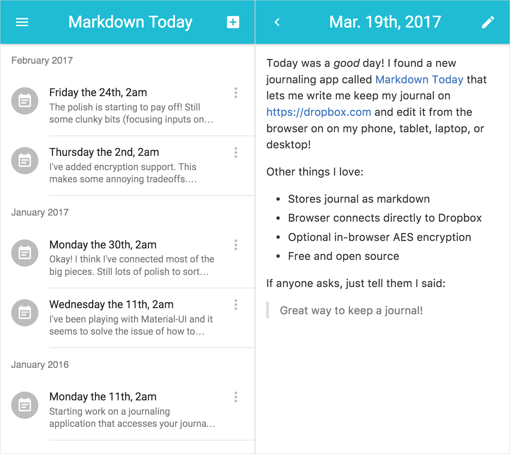

# Markdown Today

Store your journal as a markdown file on Dropbox, and edit/view it from any browser.

## Features

* Optimized for use in a mobile browser but looks great on desktop too.
* No server. You only have to trust your browser and Dropbox. (And this code)
* Persists your Dropbox token to local storage so you don't have to re-login each time.
* Optional in-browser AES encryption using [Stanford JavaScript Crypto Library](http://bitwiseshiftleft.github.io/sjcl/) for "trust no one" security.

## Commands

* Run a dev server: `npm start`.
* Run tests (in "watch" mode): `npm test`.
* Build a production bundle: `npm run build`.
* Deploy: `npm run deploy`. (Requires SSH access to the server)

## Deploying to your own server

### Get your own Dropbox Client ID

You'll need to register you fork of the app with Dropbox at their [My Apps](https://www.dropbox.com/developers/apps) page.

Update `src/constants.js` to include your new Client ID and redirect URL.

### Configure your web server

Markdown Today expects your webserver to serve `index.html` for all requests that are not found. An `.htaccess` file for Apache2 is included in `public/`.

## Technology

Many thanks for the great open-source libraries that made this project possible. To name just a few:

* [React](https://facebook.github.io/react/)
* [Redux](http://redux.js.org/)
* [Material-UI](http://www.material-ui.com/)
* [Stanford JavaScript Crypto Library](http://bitwiseshiftleft.github.io/sjcl/)